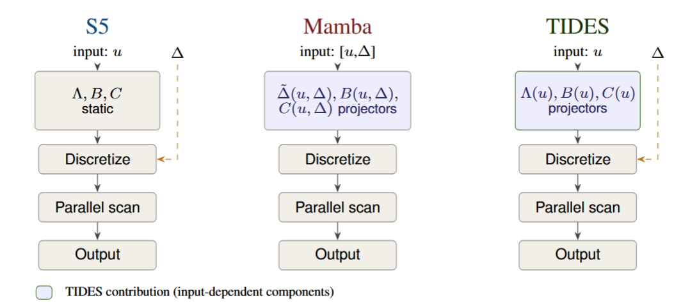

# TIDES — Time-aware Input-Dependent State Space Model



Code release accompanying the NeurIPS 2026 submission.

This repository contains the PyTorch implementation of TIDES, the training pipelines for the two main benchmarks reported in the paper (UEA time-series classification and the Physiome-ODE irregular-multivariate-time-series forecasting benchmark), and the JAX notebook used for the *Fading Flash* diagnostic.

## Repository layout

```
tides/                 PyTorch model package (importable as `tides`)
physiome_ode/          Forecasting experiments on Physiome-ODE
uea/                   Classification experiments on UEA
fading_flash/          JAX notebook + reference SSM models (kept verbatim)
data/                  Dataset placement and download instructions
docs/                  Reproducibility commands and dataset license details
```

## Installation

Single conda environment for the PyTorch experiments:

```bash
conda env create -f environment.yml
conda activate tides
```

Or with pip:

```bash
pip install -r requirements.txt
```

The Fading Flash notebook uses JAX and lives under `fading_flash/`; create a separate environment for it (see `fading_flash/README.md`).

## Reproducing the results

### UEA classification (Table 1)

For each of the six UEA datasets:

```bash
python -m uea.main --config uea/configs/eworms.yaml
python -m uea.main --config uea/configs/heartbeat.yaml
python -m uea.main --config uea/configs/motor.yaml
python -m uea.main --config uea/configs/ethanol_concentration.yaml
python -m uea.main --config uea/configs/SCP1.yaml
python -m uea.main --config uea/configs/SCP2.yaml
```

Each run repeats five seeds with a 70/15/15 random partition. Datasets are downloaded automatically via `aeon.datasets.load_classification`.

### Physiome-ODE forecasting (Table 2)

Download the Physiome-ODE benchmark from Zenodo (https://zenodo.org/records/11492058) and place its `final/` directory under `data/physiome_ode/` so each dataset folder is at `data/physiome_ode/<dataset>/<fold>/`. Then run all five folds with the best configuration:

```bash
python -m physiome_ode.run_final_folds \
    --dataset hodgkin_huxley_1952_variant01 \
    --hidden_size 32 --ssm_blocks 2 --ssm_dim_mult 2 --num_blocks 3 \
    --mode_combo input_dependent/lti/input_dependent --lr 5e-4 --weight_decay 1e-4 \
    --batch_size 32 --drop_rate 0.0 --learn_lambda standard \
    --discretization zoh --dt_min 0.001
```

Replace the `--dataset` argument and hyperparameters with the entries from `docs/reproducibility.md` for each of the 50 datasets.

To rerun the Optuna hyperparameter search from scratch:

```bash
python -m physiome_ode.hypersearch_physio \
    --dataset hodgkin_huxley_1952_variant01 \
    --fold 0 --num_trials 10 \
    --data_base_path data/physiome_ode
```

### Fading Flash diagnostic (Section "toy")

Open `fading_flash/fading_flash_experiment.ipynb` in a JAX environment.

## Compute

All PyTorch experiments were run on a single NVIDIA L40S (48 GB) GPU. UEA hyperparameter searches take 12–48 GPU-hours per dataset; Physiome-ODE final-fold runs take 0.2–2 GPU-hours per dataset.

## Datasets and licenses

This repository does not redistribute any dataset. Pointers and licensing information for every dataset and external code asset are summarised below; see `docs/dataset_licenses.md` for the full text.

| Asset | Source | License |
|-------|--------|---------|
| UEA Time Series Classification Archive (6 datasets) | http://www.timeseriesclassification.com — auto-downloaded via `aeon` | redistributed under the archive's research-use terms (Bagnall et al. 2018) |
| Physiome-ODE (50 ODE-derived datasets) | https://zenodo.org/records/11492058 (Klötergens et al., ICLR 2025) | Apache-2.0 |
| GRU-ODE-Bayes baseline | https://github.com/edebrouwer/gru_ode_bayes | MIT |
| Neural Flows baseline | https://github.com/mbilos/neural-flows-experiments | MIT |
| CRU baseline | https://github.com/boschresearch/Continuous-Recurrent-Units | AGPL-3.0 |
| LinODENet baseline | https://github.com/randolf-scholz/linodenet | MIT |
| GraFITi baseline | https://github.com/yalavarthivk/GraFITi | MIT |
| S5 reference (utilities used by the SSM scan / discretization) | https://github.com/lindermanlab/S5 | Apache-2.0 |

Baseline numbers reported in the paper are taken from the public Physiome-ODE leaderboard and from the UEA tables in Moreno-Pino et al. (2024) and Walker et al. (2024). The corresponding repositories are not redistributed here.

## Repository code license

All source code in this repository (excluding files explicitly marked otherwise in their headers) is released under the MIT License (see `LICENSE`).

## Citation

A citation block will be added to the camera-ready release. The submission is double-blind; please cite the OpenReview entry for now.
