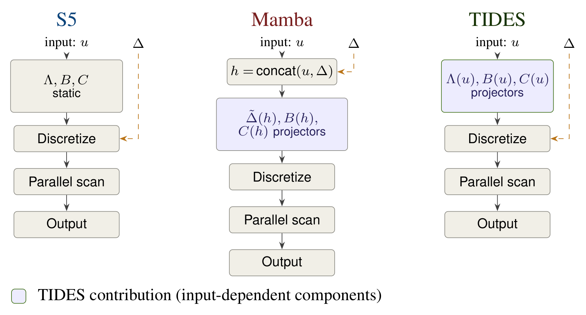

# TIDES — Time-aware Input-Dependent State Space Model



Code release accompanying the NeurIPS 2026 submission.

Selective SSMs such as Mamba make the discretisation step Δ a learned function
of the input, so Δ stops being a physical sampling interval.  TIDES moves the
input dependence off the step and onto the diagonal state matrix Λ (and B, C):
Δ keeps its meaning as the time between observations, so irregular timestamps
are handled natively, without giving up per-token selectivity.

This repository contains the PyTorch implementation of TIDES and everything
needed to reproduce the paper: UEA classification, Physiome-ODE forecasting,
the EigenWorms drop-rate experiment, and the *Fading Flash* diagnostic,
including the Mamba-1/2/3 baselines.

## Repository layout

```
tides/          PyTorch model package (importable as `tides`)
uea/            UEA classification (Table 1) and the EigenWorms drop-rate experiment
physiome_ode/   Physiome-ODE forecasting (Table 2)
fading_flash/   Fading Flash: task generator, models, figures, static dataset export
baselines/      Mamba-1/2/3 baselines: PyTorch ports and a sequence classifier
tests/          pytest suite (CPU, ~15 s)
docs/           reproducibility tables (every configuration) and dataset licenses
data/           where the datasets go (nothing is redistributed)
```

## Installation

Python 3.11:

```bash
pip install -r requirements.txt          # or: conda env create -f environment.yml && conda activate tides
pytest tests                             # quick check, CPU only
```

`pip` picks PyTorch's default CUDA build.  If your driver is older than that
build, install a matching wheel first, e.g.
`pip install torch --index-url https://download.pytorch.org/whl/cu126`.
Tested with Python 3.11 and PyTorch 2.9 and 2.14 on Linux, CPU and RTX 4090.

### Mamba baselines (optional)

Mamba-1 and Mamba-2 run on the official `mamba_ssm` CUDA kernels, which must
match your PyTorch and CUDA versions.  A combination that works (Linux, CUDA 12
driver, Python 3.11):

```bash
pip install torch==2.9.0 --index-url https://download.pytorch.org/whl/cu126
pip install einops transformers
pip install --no-deps \
  https://github.com/Dao-AILab/causal-conv1d/releases/download/v1.6.2.post1/causal_conv1d-1.6.2.post1+cu12torch2.9cxx11abiTRUE-cp311-cp311-linux_x86_64.whl \
  https://github.com/state-spaces/mamba/releases/download/v2.3.2.post1/mamba_ssm-2.3.2.post1+cu12torch2.9cxx11abiTRUE-cp311-cp311-linux_x86_64.whl
python baselines/check_mamba_ports.py    # needs a GPU; compares the ports with mamba_ssm
```

Mamba-3 needs none of this.  Its official kernel only runs on Hopper GPUs, so
the repository uses a PyTorch port of the SISO block (`baselines/mamba_blocks.py`),
checked against the official module and computed with a chunked scan.

## Using the model

```python
import torch
from tides import TIDESClassifier, step_scale_from_indices

model = TIDESClassifier(d_input=6, num_classes=5, d_hidden=16, ssm_size=16,
                        ssm_blocks=2, num_blocks=1, bidir=True)

x = torch.randn(8, 1000, 6)                       # (batch, observed steps, channels)
keep = sorted(torch.randperm(2000)[:1000].tolist())
dt = step_scale_from_indices(keep)                # gap to the previous observation
logits = model(x, step_scale=dt)                  # (8, 5); dt may also be (batch, steps)
```

`step_mode="input_dependent"` gives the Mamba-style variant used as a control in
the paper (Mamba_S): the step becomes `softplus(W [x, Δ] + b)` instead of the
observed interval.  `TIDESForecastingModel` is the forecasting model used on
Physiome-ODE.

Both models can be saved to and loaded from the Hugging Face Hub:

```python
model.save_pretrained("tides-eigenworms")         # config.json + model.safetensors
model.push_to_hub("<user>/tides-eigenworms")
model = TIDESClassifier.from_pretrained("<user>/tides-eigenworms")
```

## Reproducing the results

Every configuration used in the paper is in `docs/reproducibility.md`.  They
are the configurations found by the hyperparameter searches described in the
paper; the search code is not part of this repository.

### UEA classification (Table 1)

```bash
python uea/main.py --config uea/configs/tides/EW.yaml    # likewise SCP1, SCP2, MI, ETC, HB
```

Five seeds (42-46) on a 70/15/15 random re-split each; the script ends with
test accuracy at the best-validation epoch, mean ± std over seeds.  Datasets
download automatically via `aeon` into `data/UEA_datasets/` (`--data_dir` to
change).

### Physiome-ODE forecasting (Table 2)

Download `final.zip` from https://zenodo.org/records/11492058 and unpack the
contents of its `final/` folder into `data/physiome_ode/` (see `data/README.md`),
so that each dataset is at `data/physiome_ode/<dataset>/<fold>/`.  Then

```bash
python physiome_ode/run_final_folds.py --winner HOD01    # dataset code or name, all 50 in docs/reproducibility.md
```

runs the five folds with that dataset's configuration from
`physiome_ode/configs/winners.csv`.

### Drop-rate generalisation on EigenWorms (Figure 6)

```bash
python uea/droprate.py                                   # 10 models x 3 seeds -> results/droprate/
python uea/plot_droprate.py results/droprate/results.csv --out fig_droprate.pdf
```

Models train with half of the time steps dropped and are tested at drop rates
0.1-0.9: S5, TIDES and its ablations (Λ-only, B,C-only, full), Mamba_S, RFormer
with the published EigenWorms configuration, and Mamba-1/2/3.  `--models` and
`--seeds` select a subset; `--smoke` checks the wiring in a few minutes on CPU.
The Mamba-1/2 rows need `mamba_ssm` (above).

### Fading Flash

```bash
OMP_NUM_THREADS=1 python fading_flash/fading_flash.py    # ~12 min on one CPU core
```

trains S5, TIDES, TIDES (Λ-only), the Mamba surrogate and Mamba-1/2/3 on the
task and writes the paper's figures to `fading_flash/figures/`.  The task
itself is `fading_flash/task.py`.

A static copy of the benchmark (train, validation and a test split at each Δ)
in Hugging Face `datasets` format:

```bash
python fading_flash/make_hf_dataset.py --out_dir data/fading_flash_hf
hf upload <user>/fading-flash data/fading_flash_hf . --repo-type dataset
```

after which `datasets.load_dataset("<user>/fading-flash")` works; the
generated dataset card describes the fields.

## Compute

All PyTorch experiments were run on a single NVIDIA L40S (48 GB) GPU. UEA hyperparameter searches take 12–48 GPU-hours per dataset; Physiome-ODE final-fold runs take 0.2–2 GPU-hours per dataset.

## Datasets and licenses

This repository does not redistribute any dataset. Pointers and licensing information for every dataset and external code asset are summarised below; see `docs/dataset_licenses.md` for the full text.

| Asset | Source | License |
|-------|--------|---------|
| UEA Time Series Classification Archive (6 datasets) | http://www.timeseriesclassification.com — auto-downloaded via `aeon` | redistributed under the archive's research-use terms (Bagnall et al. 2018) |
| Physiome-ODE (50 ODE-derived datasets) | https://zenodo.org/records/11492058 (Klötergens et al., ICLR 2025) | Apache-2.0 |
| GRU-ODE-Bayes baseline | https://github.com/edebrouwer/gru_ode_bayes | MIT |
| Neural Flows baseline | https://github.com/mbilos/neural-flows-experiments | MIT |
| CRU baseline | https://github.com/boschresearch/Continuous-Recurrent-Units | AGPL-3.0 |
| LinODENet baseline | https://github.com/randolf-scholz/linodenet | MIT |
| GraFITi baseline | https://github.com/yalavarthivk/GraFITi | MIT |
| S5 reference (utilities used by the SSM scan / discretization) | https://github.com/lindermanlab/S5 | Apache-2.0 |
| Mamba / Mamba-2 / Mamba-3 (ported in `baselines/mamba_blocks.py`) | https://github.com/state-spaces/mamba | Apache-2.0 |

Baseline numbers reported in the paper are taken from the public Physiome-ODE leaderboard and from the UEA tables in Moreno-Pino et al. (2024) and Walker et al. (2024). The corresponding repositories are not redistributed here.

## Repository code license

All source code in this repository (excluding files explicitly marked otherwise in their headers) is released under the MIT License (see `LICENSE`).

## Citation

A citation block will be added to the camera-ready release. The submission is double-blind; please cite the OpenReview entry for now.
